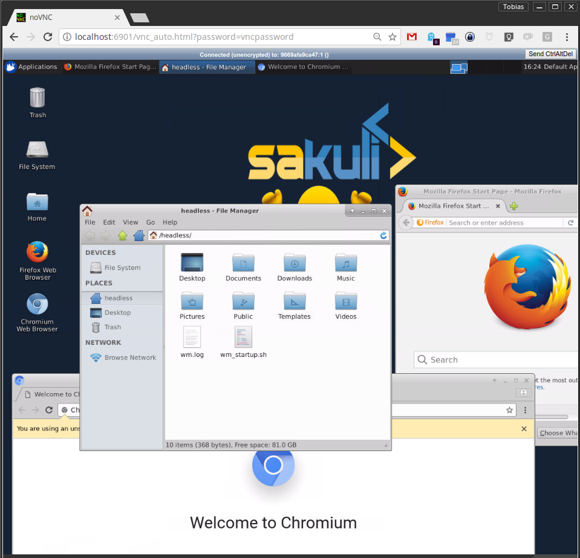

# Docker container images with "headless" VNC session

This repository contains a Docker image with headless VNC environments for Automation Testing.

Each Docker image is installed with the following components:

* Desktop environment [**Xfce4**](http://www.xfce.org) or [**IceWM**](http://www.icewm.org/)
* VNC-Server (default VNC port `5901`)
* [**noVNC**](https://github.com/novnc/noVNC) - HTML5 VNC client (default http port `6901`)
* Browsers:
  * Mozilla Firefox
  * Chromium
* Python3.8 with pip
* OpenJDK 1.8.0
* Nodejs with protractor and Typescript
  

## Current provided OS & UI sessions:
## OpenShift / Kubernetes

It's also possible to run the images in container orchestration platforms like [Kubernetes](https://kubernetes.io) or [OpenShift](https://openshift.io/). For more information how to deploy containers in the cluster, take a look at:

* [Kubernetes usage of "headless" VNC Docker images](./kubernetes/README.md)
* [OpenShift usage of "headless" VNC Docker images](./openshift/README.md) 

## Usage
Usage is **similar** for all provided images, e.g. for `consol/centos-xfce-vnc`:

- Build an image from scratch:

      docker build  -t docker:final .

- Run command with mapping to local port `5901` (vnc protocol) and `6901` (vnc web access):

      docker run -d -p 5901:5901 -p 6901:6901 docker:final
  
- Change the default user and group within a container to your own with adding `--user $(id -u):$(id -g)`:

      docker run -d -p 5901:5901 -p 6901:6901 --user $(id -u):$(id -g) consol/centos-xfce-vnc

- Run the container with root access:

      docker run -d -p 5901:5901 -p 6901:6901 -u 0 docker:final

- If you want to mount a local directory to the container use the below command
      
      docker run --name npminstall -v <absolute_local_directory>:<container_directory>  -p 5901:5901 -p 6901:6901 -e VNC_RESOLUTION=1920x960 --shm-size=1g -u 0 docker:npminstall

# Connect & Control
If the container is started like mentioned above, connect via one of these options:

* connect via __VNC viewer `localhost:5901`__, default password: `vncpassword`
* connect via __noVNC HTML5 full client__: [`http://localhost:6901/vnc.html`](http://localhost:6901/vnc.html), default password: `vncpassword` 
* connect via __noVNC HTML5 lite client__: [`http://localhost:6901/?password=vncpassword`](http://localhost:6901/?password=vncpassword)